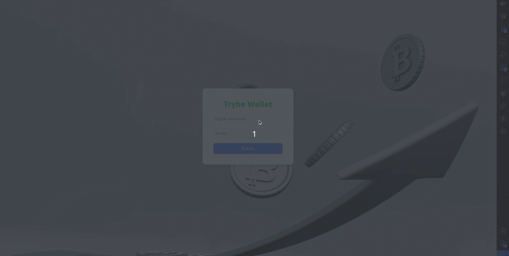

#  Проект TrybeWallet 

## 🌐 [](https://github.com/SamuelRocha91/project-trybewallet/blob/main/README.md) [](https://github.com/SamuelRocha91/project-trybewallet/blob/main/README_es.md) [](https://github.com/SamuelRocha91/project-trybewallet/blob/main/README_en.md) [](https://github.com/SamuelRocha91/project-trybewallet/blob/main/README_ru.md) [](https://github.com/SamuelRocha91/project-trybewallet/blob/main/README_ch.md) [](https://github.com/SamuelRocha91/project-trybewallet/blob/main/README_ar.md)



Этот проект был разработан в рамках фронтенд-модуля курса веб-разработки Trybe. Это органайзер для управления расходами, который позволяет пользователям контролировать свои финансы через интерфейс с проверкой логина и управлением финансовыми данными.

## Описание

Приложение представляет собой платформу для управления личными расходами и включает в себя следующие основные функции:
- Страница входа с проверкой имени пользователя и пароля.
- Страница кошелька, где пользователь может добавлять, редактировать и удалять расходы.
- Таблица расходов, отображающая данные по каждому зарегистрированному расходу.
- Полный функционал CRUD (создание, чтение, обновление, удаление) для управления расходами.

Целью проекта было развить навыки работы с маршрутами, управления состоянием с использованием Redux, жизненным циклом компонентов, интеграции форм и реализации тестов с использованием библиотеки React Testing Library.

## Используемые технологии

- **React.js** - для создания пользовательского интерфейса.
- **Redux** - для глобального управления состоянием.
- **JavaScript** - язык программирования.
- **CSS/HTML** - для оформления и структуры приложения.
- **React Testing Library** - для написания модульных тестов.
- **Docker** - для контейнеризации приложения.

## Основные функции

- **Работа с маршрутами**: использование React Router для навигации между страницами входа и управления кошельком.
- **Redux**: централизованное управление состоянием приложения, включая расходы.
- **Проверка пользователя**: логика для проверки входа (имя пользователя и пароль).
- **Таблица расходов**: добавление, редактирование и удаление расходов, отображаемых в динамической таблице.
- **Тесты**: реализация тестов с использованием библиотеки `React Testing Library`.

## Структура приложения

Приложение делится на две основные страницы:

1. **Страница входа**: пользователь вводит свои учетные данные для входа.
2. **Кошелек**: пользователь может управлять своими расходами.

Таблица расходов отображает подробную информацию о каждом расходе, включая описание, сумму, способ оплаты, валюту и другие детали.

## Инструкции по запуску

Приложение можно легко запустить с помощью **Docker**. Следуйте инструкциям ниже, чтобы запустить его в вашем локальном окружении.

### Необходимые условия

- На вашем компьютере должен быть установлен **Docker**.

### Шаги для запуска:

1. Клонируйте этот репозиторий:
   ```bash
   git clone https://github.com/your-username/repository-name.git
   ```

2. Перейдите в папку с проектом:
   ```bash
   cd repository-name
   ```

3. Соберите Docker-образ:
   ```bash
   docker build -t react_store .
   ```

4. Запустите контейнер:
   ```bash
   docker run -d --name react -p 3000:3000 react_store
   ```

5. Откройте приложение в браузере:
   ```
   http://localhost:3000
   ```

## Структура проекта

```bash
.
├── src
│   ├── components
│   ├── pages
│   ├── store
│   ├── App.js
│   ├── index.js
│   └── ...
├── public
├── Dockerfile
├── package.json
└── README.md
```

### Основные компоненты

- **Header**: отображает заголовок приложения.
- **WalletForm**: форма для добавления новых расходов.
- **Table**: таблица расходов с возможностью редактирования и удаления данных.

## Тестирование

Тесты были реализованы с использованием **React Testing Library**. Чтобы запустить тесты:

```bash
npm test
```

## Другие проекты

- ⚽ [Typescript FootBall API](https://github.com/SamuelRocha91/trybeFutebolClube/blob/main/README_ru.md)
- 🐉 [Trybers and Dragons](https://github.com/SamuelRocha91/trybeAndDragons/blob/main/README_ru.md)
- 🌶️ [Recipes App](https://github.com/SamuelRocha91/ProjectRecipesApp/blob/main/README_ru.md)
- 🎮 [Trivia](https://github.com/SamuelRocha91/trivia_game/blob/main/README_ru.md)
- 🪧 [Blogs Api](https://github.com/SamuelRocha91/BlogsApi/blob/main/README_ru.md)
- 🗡️ [Trybe Smith](https://github.com/SamuelRocha91/TrybeSmith/blob/main/README_ru.md)
- 🐣 [Pokedex](https://github.com/SamuelRocha91/pokedex/blob/main/README_ru.md)
- 🏪 [FrontEnd Online Store](https://github.com/SamuelRocha91/project-frontend-online-store/blob/main/README_ru.md) 

